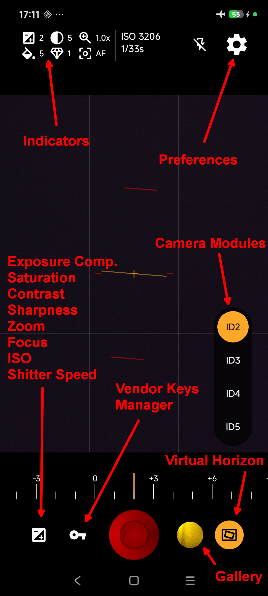
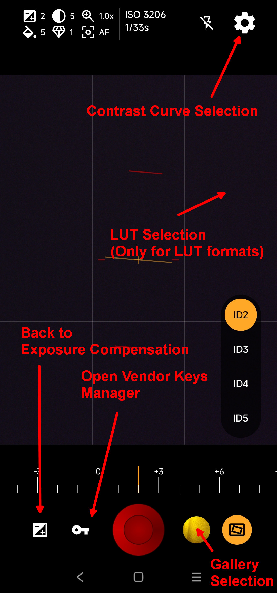
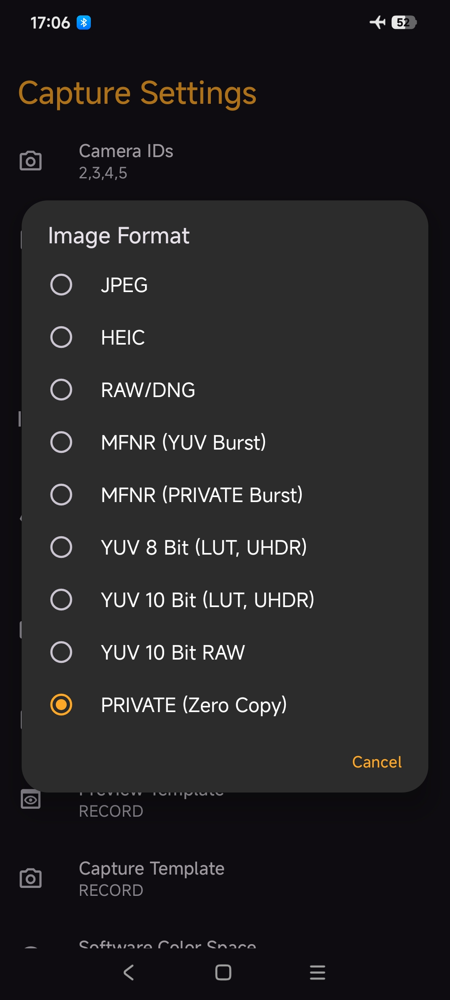
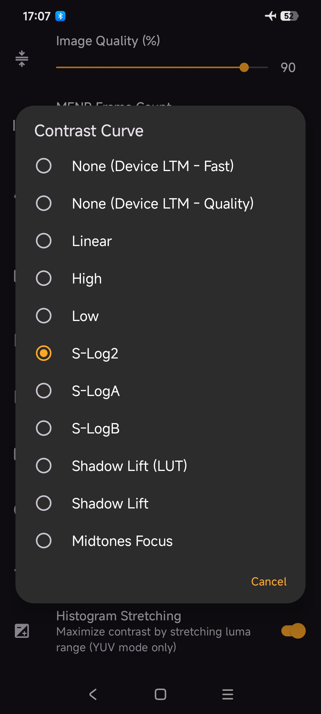

# PlainCam(X) Public
Public part of PlainCam(X) providing APKs and additional documentation

## Links
Latest Build   
Group Chat and Feedback   

## PlainCam and PlainCamX
PlainCam tries to follow all the rules to be Google Play Store compliant  
PlainCamX is not bound by these restrictions and uses techniques like reflection to e.g. discover as much device vendor keys as possible

## Prerequisite
Basic functionality is available for devices starting with Android 10 (API 29)  
All extended functions are available starting with Android 14 (API 34)  
Should work on devices without any RAW support as well

## PlainCam(X) Motivation/Purpose
PlainCam(X) is a greenfield camera implementation build upon learnings from PhotonVidCam development  
It follows a different approach to all the RAW based camera apps like GCam, MotionCam, Photon Camera and a lot of new contenders appeared in 2026  
The base of PlainCam and PlainCamX are ISP processed single shot captures

## Basic Configuration
PlainCam(X) does not include a camera module (ID) detection  
Users have to provide all camera IDs the app shall use  
This is the first field in Preferences/Settings  
Camera IDs can be discovered by several dedicated Camera2 API apps like [Camera2Keys](https://play.google.com/store/apps/details?id=com.particlesdevs.camera2keys)  
The comma separated list can contain logical, physical and combinations of logical and physical  
Example: 0,0-2,2  

## Features
* GTM (Global Tone Mapping) in form of ___Contrast Curves___ (low dynamic range, low noise))
* Support for ___Per Lens___ (Camera Module) settings
* Support for ___Per Format___ settings
* LUT support (PNG and CUBE)
* Ultra HDR
* Histogram
* Enhanced metadata (using tags IMAGE_DESCRIPTION and USER_COMMENT)
* Vendor Keys Manager (key discovery only in PlainCamX)
* Virtual Horizon

## User Interface
<table>
  <tr>
    <td align="center">
      <b>Viewfinder</b> 
      
    </td>
    <td align="center">
      <b>Longpress Actions</b> 
      
    </td>
  </tr>
  <tr>
    <td align="center">
      <b>Formats</b> 
      
    </td>
    <td align="center">
      <b>Contrast Curves</b> 
      
    </td>
  </tr>
</table>

## Longpress Actions
...

## Other interesting (RAW based) Android Camera Apps
[Rawr](https://github.com/adityawarmanfw/rawr/releases/tag/v0.2.0)  
[RawLens](https://github.com/matthew777777/RawLens)  
[Unspektrawesome](https://github.com/EkinStrop/Unspektrawesome-Releases)
